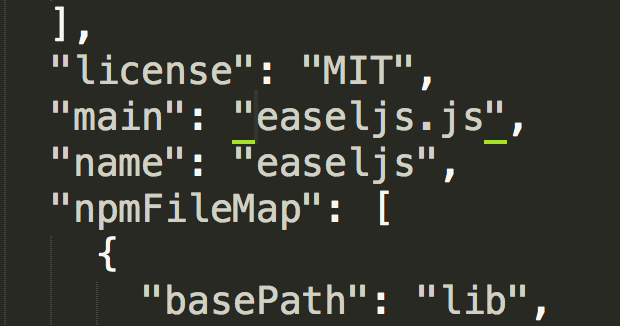
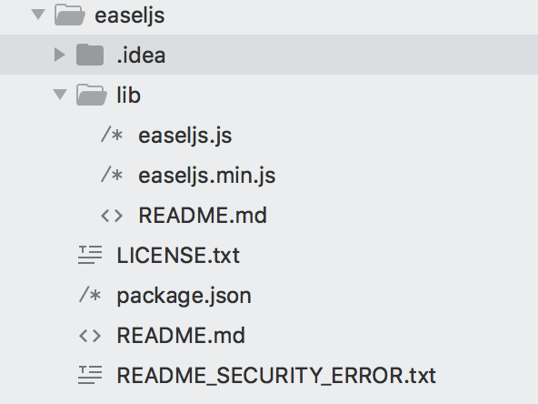
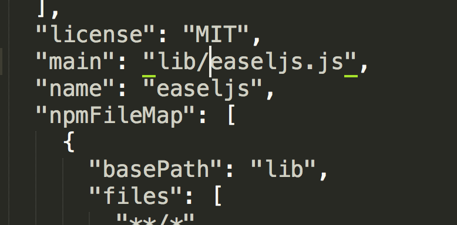
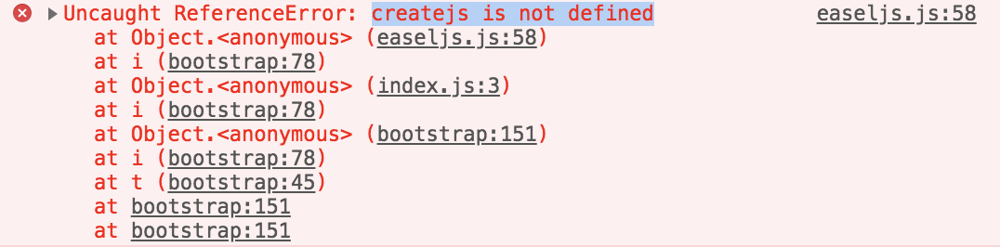

# 报错信息

## 导入 easeljs 模块，报 `Module not found`

`npm list | grep easeljs` 确认 easeljs 已经安装成功


再检查 easeljs 中的 `pageage.json` 文件，发现 `main` 属性指向的路径不对





**解决方法：**修改 `pageage.json` 中的 `main` 属性路径



## 导入 easeljs 模块成功后，浏览器报 `createjs is not defined` 错误



**原因：**

```javascript
// 源码第一句
this.createjs = this.createjs||{};
```

因为 createjs 的各个库文件的全局对象不是暴露在 window  中而是 this，所以会报错。

**解决方法：**

使用 `imports-loader` 来打包

```javascript
// 未使用 imports-loader
import { Stage } from 'easeljs';
// 使用 imports-loader
import { Stage } from 'imports-loader?this=>window!easeljs';
```

